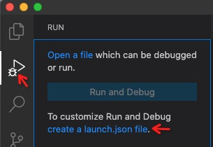

# ZhaGaNa

Step by step guide to use [Playwright][pw].

## Project Setup

Create a as simple as we can project manually:

```sh
mkdir zhagana
cd zhagana
npm init
```

Install [Playwright][pw] and [TypeScript][ts] via npm, which may take some minutes to download browser binaries:

```sh
npm i playwright
npm i -D typescript
```

### TypeScript Configuration

Playwright for JavaScript and TypeScript is generally available. But we still need some configuration for TypeScript. Create a `tsconfig.json` file with the following content:

```json
{
  "compilerOptions": {
    "target": "es5",
    "module": "commonjs",
    "outDir": "build",
    "sourceMap": true
  }
}
```

### VS Code Launcher and Debuger

Click the **RUN** button on the left menu then **create a launch.json**. Select **Node.js** from the drop down if you have other debugger extensions.



Make sure you have `"preLaunchTask": "tsc: build - tsconfig.json"` and `"outFiles": ["${workspaceFolder}/build/**/*.js"]` in _launch.json_.

```json
{
  "version": "0.2.0",
  "configurations": [
    {
      "type": "node",
      "request": "launch",
      "name": "Launch Program",
      "skipFiles": [
        "<node_internals>/**"
      ],
      "program": "${workspaceFolder}/index.ts",
      "preLaunchTask": "tsc: build - tsconfig.json",
      "outFiles": ["${workspaceFolder}/build/**/*.js"]
    }
  ]
}
```

## Coding

### Screenshot

We will start by taking a screenshot of the page. This is code [from their documentation](https://playwright.dev/#version=v1.5.1&path=docs%2Fintro.md&q=first-script), but transfer into TypeScript

```ts
import { webkit } from 'playwright'

(async () => {
  const browser = await webkit.launch();
  const page = await browser.newPage();
  await page.goto('http://whatsmyuseragent.org/');
  await page.screenshot({ path: `out/whatsmyuseragent.png` });
  await browser.close();
})();
```

Press `F5` to run our project, and we will get the _out/whatsmyuseragent.png_ file like this


Now, let's make it happen in 3 browsers:

```ts
import { Browser, BrowserType, chromium, firefox, webkit } from 'playwright'

async function screenshot(browserType: BrowserType<Browser>) {
  // use `browserType` from arguments instead of hardcode
  const browser = await browserType.launch();
  const page = await browser.newPage();
  await page.goto('http://whatsmyuseragent.org/');
  await page.screenshot({ path: `out/ua-${browserType.name()}.png` });
  await browser.close();
}

(async () => {
  // 3 different kind of browsers
  const BROWSER_TYPES = [
    chromium,
    firefox,
    webkit
  ]
  // make screenshot all together
  await Promise.all(BROWSER_TYPES.map((browserType) => {
    return screenshot(browserType);
  }));
})();
```

Here we use the `screenshot` function to take the place of main function and use `Promise.all` to handle 3 browsers in parallel. After a few seconds, we will get 3 screenshots:

- _out/ua-chromium.png_ with `HeadlessChrome`
- _out/ua-firefox.png_ with `Firefox`
- _out/ua-webkit.png_ with `AppleWebKit ... Safari`

### Emulation - Mobile Device

Next step, we will simulate browser behavior on a mobile device and navigate to [Google Maps](https://www.google.com/maps).

```ts
import { Browser, BrowserType, devices, chromium, firefox, webkit } from 'playwright'

async function screenshot(browserType: BrowserType<Browser>) {
  // use `browserType` from arguments instead of hardcode
  const browser = await browserType.launch();
  // simulate browser behavior on a mobile device
  const iphone = devices['iPhone X'];
  const context = await browser.newContext({ ...iphone });
  // open web page
  const page = await context.newPage();
  await page.goto('https://www.google.com/maps');  
  // take screenshot
  await page.screenshot({ path: `out/map-${browserType.name()}.png` });
  await browser.close();
}
```

Since firefox does not support mobile, we reduce our browsers to chromium and webkit only:

```ts
(async () => {
  // firefox does not support mobile
  const BROWSER_TYPES = [ chromium, webkit ]
  // make screenshot all together
  await Promise.all(BROWSER_TYPES.map((browserType) => {
    console.log(`launch: ${browserType.name()}`);
    return screenshot(browserType);
  }));
})();
```

`F5` again we will get 2 _png_ file in _out_ directory:

| chromium | webkit |
|:---:|:---:|
|  |  |

Maps came out, but seems not complete loaded. So we need `.waitForNavigation()` after `page.goto()`:

```ts
await page.goto('https://www.google.com/maps');
await page.waitForNavigation();
await page.screenshot({ path: `out/map-${browserType.name()}.png` });
```

But, wait... there is a blocker comes up: Google Maps want us to download App but we just want to **STAY ON WEB**.


### Input - Mouse Click

From devtools we can get the selector of this promo: `.ml-promotion-nonlu-blocking-promo`, use `page.waitForSelector()` instead of `page.waitForNavigation()` to catch the promotion:


```ts
await page.goto('https://www.google.com/maps');
await page.waitForSelector('.ml-promotion-nonlu-blocking-promo');
```

So let's click the **STAY ON WEB** button on the page! From devtools we can also get the selector of this button: `button.ml-promotion-action-button.ml-promotion-no-button`, use `page.click()` to trigger the click event:


```ts
// click STAY ON WEB
await page.click('button.ml-promotion-action-button.ml-promotion-no-button');
```

As the invisible animation last for 0.3s, we need to wait for more than 300ms after button clicked, before we capture the screenshot.


```ts
// wait for more than 300 millisecond for browser to response with the events
await page.waitForTimeout(400);
await page.screenshot({ path: `out/map-${browserType.name
```

### Emulation - Geolocation

Now we have the map in our current location (may be base on IP address) but we also have the ability to simulate to a different place. We can "fly" to town _Tewo_ by
reating a context with "geolocation" permissions granted:

```ts
const context = await browser.newContext({
  ...iphone,
  geolocation: {
      longitude: 103.2199128,
      latitude: 34.0556586,
  },
  permissions: ['geolocation'],
});
```

If you don't konw the longitude and latitude of your "perfect place", just search it in Google Maps then you can get it from the browser URL.


Click the **Your Location** button to navigate to our emulated geolocation.


```ts
// click `your location` to navi to current location
await page.click('button.ml-button-my-location-fab');
// As I can not find any event which means relocat finished,
// so we need to wait for some seconds for Google Maps to load resources
await page.waitForTimeout(500);
```

Re-run our project we will find us located in _Tewo Post Bureau_.


### Input - Text Input

After these simulations, we can start to control the page with more playwright APIs, just like what we click the page just now.

First, fill in the search bar with our target place, like _Zhagana_.


```ts
await page.click()
await page.fill('#TODO', 'Zhagana');
```

Second, click the Search button.

```ts
await page.click('TODO');
```

Third, click **Navigate** and google will provide us the navigation route.

```ts
await page.click('TODO');
```

Put them all together, with output path string as a result.

```ts
// TODO: all screenshot code...
```

<!-- TODO: 2 screenshot -->

### Image Diff

The 2 screenshots look exactly the same, so we can use some tools to check. [Pixelmatch](https://github.com/mapbox/pixelmatch) is a simple and fast JavaScript pixel-level image comparison library. Create a function to compare two file A and B.

```ts
async function diff(fileA: string, fileB: string) {
  // read the 2 different PNG file
  const mapChromium = PNG.sync.read(fs.readFileSync(fileA));
  const mapWebkit = PNG.sync.read(fs.readFileSync(fileB));
  // init the diff image buffer
  const { width, height } = mapChromium;
  const diffImg = new PNG({ width, height });
  // pixel diff
  pixelmatch(
    mapChromium.data,
    mapWebkit.data,
    diffImg.data,
    width,
    height,
    { threshold: 0.1 }
  );
  // print out the diff image
  fs.writeFileSync('out/map-diff.png', PNG.sync.write(diffImg));
}
```

<!-- TODO: diff image -->

## Postscript

> //TODO: Zhagana introduction

[pw]: https://playwright.dev
[ts]: https://www.typescriptlang.org
